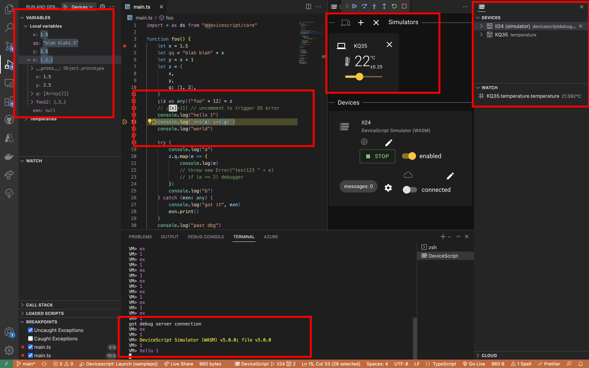

# DeviceScript 

**TypeScript for Tiny IoT Devices.**

DeviceScript brings a professional TypeScript developer experience to low-resource microcontroller-based devices.
DeviceScript is compiled to a custom VM bytecode, which can run in very constrained
environments.

-   [Read the documentation](https://microsoft.github.io/devicescript)

## Contributing

Contributions are welcome! See [contributing page](./CONTRIBUTING.md).

## Trademarks

This project may contain trademarks or logos for projects, products, or services. Authorized use of Microsoft
trademarks or logos is subject to and must follow
[Microsoft's Trademark & Brand Guidelines](https://www.microsoft.com/en-us/legal/intellectualproperty/trademarks/usage/general).
Use of Microsoft trademarks or logos in modified versions of this project must not cause confusion or imply Microsoft sponsorship.
Any use of third-party trademarks or logos are subject to those third-party's policies.
