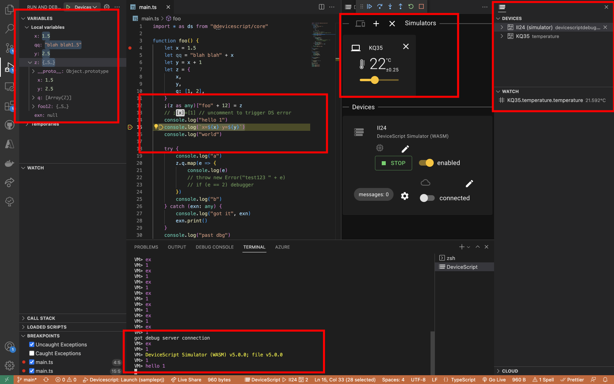

# Visual Studio Code Extension for DeviceScript

[DeviceScript](https://aka.ms/devicescript) is a TypeScript-like language and runtime for embedded devices.

-   Compile DeviceScript to bytecode
-   live Jacdac device explorer
-   Running a simulator on the developer machine
-   Debugging, including stepping, variables, stack traces, of DeviceScript programs on a simulator or hardware device.

## Contributing

Contributions are welcome! See [contributing page](../CONTRIBUTING.md).

## Trademarks

This project may contain trademarks or logos for projects, products, or services. Authorized use of Microsoft
trademarks or logos is subject to and must follow
[Microsoft's Trademark & Brand Guidelines](https://www.microsoft.com/en-us/legal/intellectualproperty/trademarks/usage/general).
Use of Microsoft trademarks or logos in modified versions of this project must not cause confusion or imply Microsoft sponsorship.
Any use of third-party trademarks or logos are subject to those third-party's policies.
