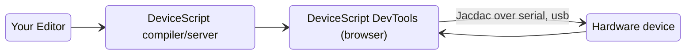

# Developer

The DeviceScript developer experience is designed to be friendly with developers familiar with TypeScript projects.
DeviceScript uses the TypeScript syntax and the developer tooling does not require any special hardware

## Live documentation

Most code examples can be loaded in the side-editor by clicking the `Run` button; or in other cloud-based virtual machine by hovering on the source and clicking on the apprioriate button.

```ts
every(1, () => {
    console.log(`hello`)
})
```

## How tools work

Communicating with hardware device typically involves a native connection using serial (UARL), USB or Bluetooth.
This kind of communication is typically platform specific and creates a lot of complexity to support cross-platform tools.
Native communication connection typically do not work when working from a container/virtual machine.

On the other hand, modern browsers have been supporting communication with hardware devices, with WebSerial, WebUSB and WebBluetooth. Therefore, this is the preferred solution used by DeviceScript to communicate with hardware.

When developing a DeviceScript program, the command line will start a web server that acts as a bridge between
a developer tools web page and the compilation results.



:::tip
If you are developing the C++ firmware for DeviceScript,
you will need a more traditional embedded development setup.
:::
