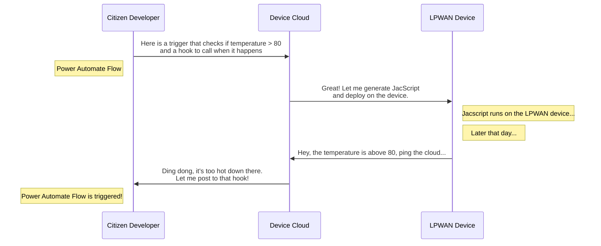

# Architecture

## Personas

* C, citizen developer
* W, web developer
* F, firmware developer

# Flow to Device

```mermaid
sequenceDiagram
    participant CD as Citizen Developer
    participant DV as Device Cloud
    participant D as LPWAN Device
    CD->>DV: Here is a trigger that checks if temperature > 80<br/> and a hook to call when it happens
    Note left of CD: Power Automate Flow
    DV->>D: Great! Let me generate JacScript <br/> and deploy on the device.
    Note right of D: Jacscript runs on the LPWAN device...
    Note right of D: Later that day...
    D->>DV: Hey, the temperature is above 80, ping the cloud...
    DV->>CD: Ding dong, it's too hot down there. <br/>Let me post to that hook!
    Note left of CD: Power Automate Flow is triggered!
```