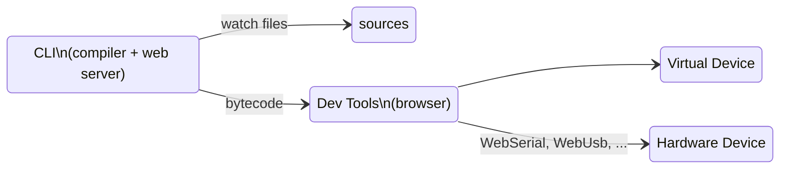

# Command Line Interface

The DeviceScript command line (CLI) allows to compile and debug programs from your favorite IDE.
The CLI also usable within containers (Docker, GitHub Codespaces, CodeSandbox, ...).

## Setup

-   install [Node.js](https://nodejs.org/en/download/)
-   install the CLI using `npm` or `yarn`

```bash
# yarn
yarn add -D @devicescript/cli
```

```bash
#npm developer dependency
npm install @devicescript/cli --save-dev
```

```bash
#npm globally
npm install -g -u @devicescript/cli
```

The command tool is named `devicescript` or `devsc` for short.
The full list of options for each command is available through the CLI by running `devsc help <command>`.


## devsc init

The `init` commands creates or updates the necessary files to get syntax completion
and checking in DeviceScript project (typically from Visual Studio Code). The command expects to be in the project folder.

```bash
devsc init
```

A device script project will look as follows:

```
.devicescript     reserved folder for devicescript generated
    /lib          supporting runtime types and libraries
    /bin          compilation file output
.gitignore        if you are using git, make sure to ignore .devicescript
main.ts           usual name for your entry point application
package.json      additional dependencies and also has the `devicescript` field entry
tsconfig.json     configure the TypeScript compiler to compile DeviceScript syntax
...               A few additional files supporting the coding experience in VS Code
```

### --force

By default, `init` will not override existing `tsconfig.json`. Using this flag, you can override this setting
and force refreshing that file.

```bash
devsc init --force
```

## devsc build

The `build` command compiles a DeviceScript file (default is `main.ts`), using the resolution rules in `tsconfig.json`. It is the default command.

```bash
devsc build main.ts
```

or, for short,

```bash
devsc build
```

### --stats

The ``--stats`` flag enables printing additional debugging information about code size,
and other useful metrics.

```bash
devsc build --stats
```

### --watch

To automatically rebuild your program based on file changes,
add `--watch`.

```bash
devsc build --watch
```

When the build is run in watch mode, it also opens a developer tool web server that allows
to execute the compiled program in a virtual device or physical devices. Follow the console
application instructions to open the web page.




#### --internet

To access the developer tools outside localhost, add `--internet`

```bash
devsc build --watch --internet
```

## devsc devtools

The `devtools` command launches the developer tool server, without trying to build a project.

```bash
devsc devtools
```

#### --internet

To access the developer tools outside localhost, add `--internet`

```bash
devsc devtools --internet
```
