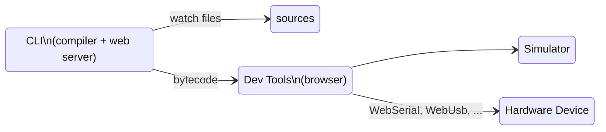

# Command Line Interface

The DeviceScript command line (CLI) allows to compile and debug programs from your favorite IDE.
The CLI also also usable within containers (Docker, GitHub Codespaces, CodeSandbox, ...).

## Setup

-   install [Node.js](https://nodejs.org/en/download/) 18+
-   install the CLI

```bash npm2yarn
npm install @devicescript/cli@latest --save-dev
```

The command tool is named `devicescript` or `devs` for short.
The full list of options for each command is available through the CLI by running `devs help <command>`.

## devs init \[dir\]

The `init` commands creates or updates the necessary files to get syntax completion
and checking in DeviceScript project (typically from Visual Studio Code).

```bash
devs init myproject
```

The command will create the files under `myproject`. A device script project will look as follows:

```
.devicescript     reserved folder for devicescript generated
    /lib          supporting runtime types and libraries, this folder is overerwritten on every build
    /bin          compilation file output
.gitignore        if you are using git, make sure to ignore .devicescript
main.ts           usual name for your entry point application
package.json      projet configuration
tsconfig.json     configure the TypeScript compiler to compile DeviceScript syntax
devsconfig.json   configure the DeviceScript compiler with additional flags. Also used by VSCode extension to activate.
...               A few additional files supporting the coding experience in VS Code
```

::: note

Make sure to keep the `devsconfig.json` file even if it is empty.
It is used as a marker to activate the [Visual Studio Code extension](/getting-started/vscode).

### --force

By default, `init` will not override existing `tsconfig.json`. Using this flag, you can override this setting
and force refreshing that file.

```bash
devs init --force
```

### --install

Run `npm` or `yarn ` install after dropping the files.

## devs build

The `build` command compiles a DeviceScript file (default is `main.ts`), using the resolution rules in `tsconfig.json`. It is the default command.

```bash
devs build main.ts
```

or, for short,

```bash
devs build
```

### custom services

The command line will automatically compile markdown files under the `services` folder (`./services/*.md`)
into TypeScript client definition in `.devicescript/lib/services.d.ts`.

### --stats

The `--stats` flag enables printing additional debugging information about code size,
and other useful metrics.

```bash
devs build --stats
```

## devs devtools

The `devtools` command launches the developer tool server, without trying to build a project.

```bash
devs devtools
```

### build watch

To automatically rebuild your program based on file changes,
add the file name.

```bash
devs devtools main.ts
```

When the build is run in watch mode, it also opens a developer tool web server that allows
to execute the compiled program in a simulator or physical devices. Follow the console
application instructions to open the web page.



#### --internet

To access the developer tools outside localhost, add `--internet`

```bash
devs devtools --internet
```

## devs flash

Command to flash the DeviceScript firmware onto a physical device. There are dedicated documentation
pages to support various MCU architectures.

-   [ESP32](/devices/esp32/)
-   [RP2040](/devices/rp2040/)
