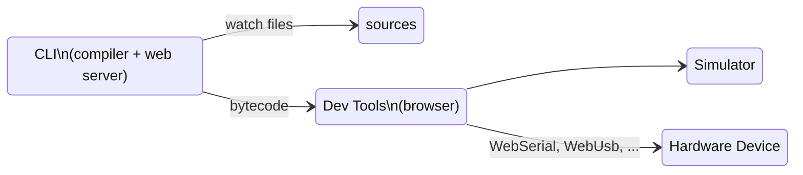

# Command Line Interface

The DeviceScript command line (CLI) allows to compile and debug programs from your favorite IDE.
The CLI is also usable within containers (Docker, GitHub Codespaces, CodeSandbox, ...).

## Setup

-   install [Node.JS 16+](https://nodejs.org/en/download/)
-   install the CLI

```bash npm2yarn
npm install @devicescript/cli@latest --save-dev
```

The command tool is named `devicescript` or `devs` for short.
The full list of options for each command is available through the CLI by running `devs help <command>`.

## devs init \[dir\]

The `init` commands creates or updates the necessary files to get syntax completion
and checking in DeviceScript project (typically from Visual Studio Code).

```bash
devs init myproject
```

The command will create the files under `myproject`. A device script project will look as follows:

```
.devicescript/     reserved folder for devicescript generated files
package.json       projet configuration
devsconfig.json    configure the DeviceScript compiler with additional flags,
                   also used by VSCode extension to activate.
src/               directory for DeviceScript sources
src/main.ts        usual name for your entry point application
src/tsconfig.json  configure the TypeScript compiler to compile DeviceScript syntax
...
```

:::note

Make sure to keep the `devsconfig.json` file even if it is empty.
It is used as a marker to activate the [Visual Studio Code extension](/getting-started/vscode).

:::

### --force

By default, `init` will not override existing `tsconfig.json`. Using this flag, you can override this setting
and force refreshing that file.

```bash
devs init --force
```

### --no-install

Do not run `npm` or `yarn` install after dropping the files.

### --board board-id

Specify the device identifier to use for the project.
The generate will patch `./src/main.ts` and insert the board import statement.

## devs add ...

The generated project by `init` is barebone by design. The `add` command can be used to
update the project with extra features. Each add command may require additional arguments.

### add test

Configures the project to add DeviceScript unit tests.

```bash
devs add test
```

### add board

Configures the project to add a custom device configuration (`board`).

```bash
devs add board
```

### add service

Configures the project to add custom services.

```bash
devs add service
```

### add sim

Configures the project to add a Node.JS subproject that runs simulated devices.

```bash
devs add sim
```

### add npm

Prepare the project to be published to [npm.js](https://npmjs.com/) as a library.

```bash
devs add npm
```

## devs build

The `build` command compiles the entry point file from the current project
using the resolution rules in `tsconfig.json`. It is the default command.

```bash
devs build
```

### custom services and boards

The command line will automatically compile markdown files under the `services` folder (`./services/*.md`)
into TypeScript client definition in `node_modules/@devicescript/core/src/services.d.ts`.

### --stats

The `--stats` flag enables printing additional debugging information about code size,
and other useful metrics.

```bash
devs build --stats
```

## devs devtools

The `devtools` command launches the developer tool server, without trying to build a project.

```bash
devs devtools
```

### build watch

To automatically rebuild your program based on file changes,
add the file name.

```bash
devs devtools src/main.ts
```

When the build is run in watch mode, it also opens a developer tool web server that allows
to execute the compiled program in a simulator or physical devices. Follow the console
application instructions to open the web page.



### --internet

To access the developer tools outside localhost, add `--internet`

```bash
devs devtools --internet
```

### --usb, --serial, --spi

These flags tell the CLI to open native transports to USB, Serial or SPI devices. Each of these flags requires to install separate packages. These packages are not installed by default, as they typically have native dependencies and may not successfully install on all environments.

#### --usb

Uses [usb package](https://www.npmjs.com/package/usb) to communicate with USB devices.

```bash npm2yarn
npm install usb
devs devtools --usb
```

#### --serial

Uses [serialport package](https://www.npmjs.com/package/serialport) to communicate with USB devices.

```bash npm2yarn
npm install serialport
devs devtools --serial
```

#### --spi

On Raspberry Pi, uses [node-rpio](https://www.npmjs.com/package/rpio) and [spi-dev](https://www.npmjs.com/package/spi-dev).

```bash npm2yarn
npm install rpio spi-dev
devs devtools --spi
```

## devs flash

Command to flash the DeviceScript firmware onto a physical device. There are dedicated documentation
pages to support various MCU architectures.

-   [ESP32](/devices/esp32/)
-   [RP2040](/devices/rp2040/)

## devs bundle

Bundle firmware, DeviceScript program, and settings into one image.
[Learn more](/developer/bundle)
