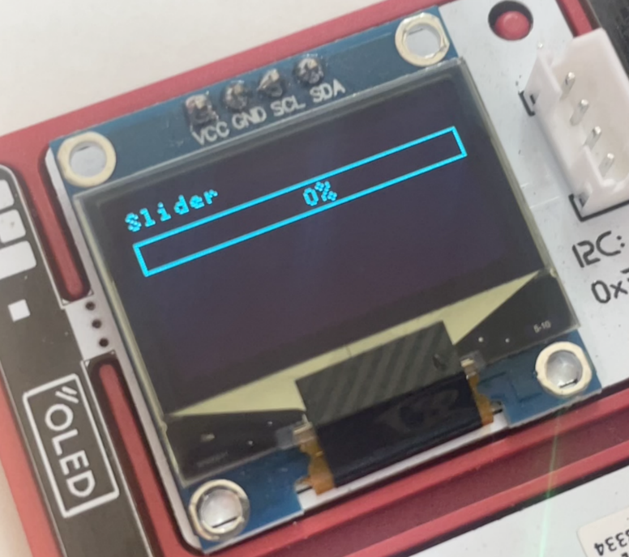

import WokwiEditor from "@site/src/components/WokwiEditor"

# SSD1306

Driver for SSD1306 OLED screen at I2C address `0x3c` (or `0x3d`).

```ts
import { SSD1306Driver } from "@devicescript/drivers"
```

-   [Datasheet](https://www.digikey.com/htmldatasheets/production/2047793/0/0/1/ssd1306.html)



## Hardware configuration

-   Configure the I2C connection through the [board configuration](/developer/board-configuration)
-   Check that you are using the proper I2C address

## Display

The driver implements the [Display](/developer/graphics/display) interface and can be used as various services.
Using the driver through services provides a better simulation experience.

## Driver

You can also use the SS1306 driver directly. However, it will not be usable from a simulator.

-   [Source](https://github.com/microsoft/devicescript/blob/main/packages/drivers/src/ssd1306.ts)

```ts
import { SSD1306Driver } from "@devicescript/drivers"

const ssd = new SSD1306Driver({ width: 64, height: 48 })
await ssd.init()
ssd.image.print("Hello world!", 3, 10)
await ssd.show()
```

## Examples

<WokwiEditor projectId="370250148258841601">
