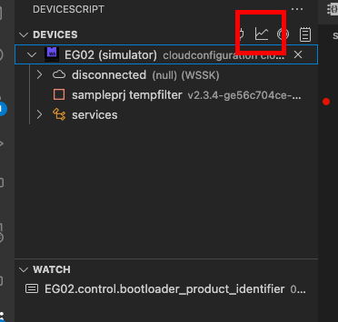

# Console output

DeviceScript supports basic `console` functionality which allows you to add logging to your script.

```ts
console.debug("debug")
console.log("log")
console.warn("warn")
console.error("error")
```

The console output will be visible in the DeviceScript terminal window.

## Console data

`console.data` is a special purpose function to log sensor data. A timestamp (`ds.millis()`) is automatically added by the runtime.

```ts
const temp = 20
const humi = 60

console.data({ temp, humi })
```

In Visual Studio Code, you will find the data in the **DeviceScript - Data** output pane or you can download it from the view menu.



## Format strings

The `console.log()` takes zero or more arguments of any type.
Template literals and string concatenation are also supported.
Compiler internally constructs a format string (see below).

```ts
let x = 0
let y = 4
console.log("Hello world")
console.log("X is", x, "and Y is", y)
console.log("X=", x, "Y=", y)
console.log(`X=${x} Y=${y}`)
console.log("X=" + x + " Y=" + y)
```

The compiler is smart about adding spaces (the second and third examples will print `X is 7 and Y is 12`
and `X=7 Y=12` respectively).

Concatenation and template literals can be also used to write registers.

```ts skip
const screen = new ds.CharacterScreen()
let x = 7
screen.message.write("X = " + x)
screen.message.write(`X is ${x}`)
```

You can also use the `ds.format()` function directly, either with `console.log()` or
when setting string registers.
Arguments are `{0}`, `{1}`, ..., `{9}`, `{A}`, `{B}`, ..., `{F}`.
A second digit can be supplied to specify precision (though this doesn't work so well yet):

```ts skip
const screen = new ds.CharacterScreen()
let x = 7,
    y = 12

console.log(ds.format("X is {0} and Y is {1}", x, y))
console.log(ds.format("X = {04}", x))
screen.message.write(ds.format("X is {0}", x))
```
