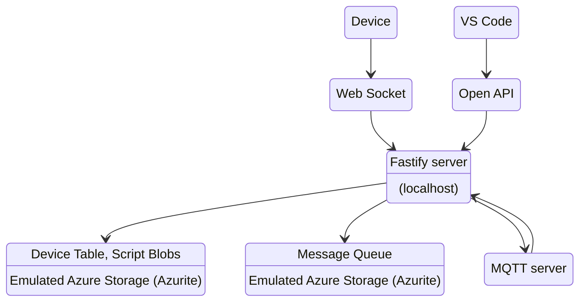
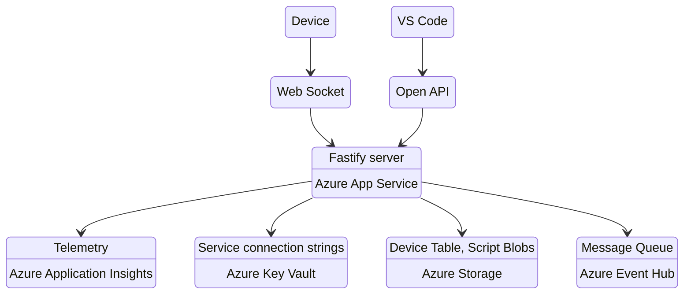
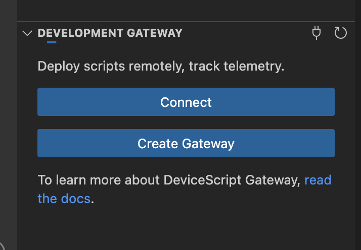

# Development Gateway

DeviceScript defines a cloud layer
to abstract the communication between the device and a cloud provider.

In order to facilitate rapid prototyping,
it is possible to run a Development Gateway **locally**
or deploy it to Azure on top of Azure services.

-   Full sources at https://github.com/microsoft/devicescript-gateway

## Features

-   Local or Azure deployment
-   Device provisioning, management: register, unregister, list, ...
-   Script management: create, update (versioned)
-   Script deployment: assign a script to a device and the gateway will deploy it
-   Analytics through Azure Monitor
-   JSON messages from and to devices
-   Per-device environment variables
-   Swagger API front end for non-embedded clients
-   Visual Studio Code extension

:::caution

The Development Gateway is a sample and not meant for production deployment.

:::

## Prerequisites

Follow these steps to get started with using the gateway.

-   install [Node.JS 16+](https://nodejs.org/en/download/)
    and the [Azure CLI](https://learn.microsoft.com/en-us/dotnet/azure/install-azure-cli).
-   fork https://github.com/microsoft/devicescript-gateway/

The full sources of the Gateway is available in that repository.

-   install the dependencies and pull the submodules

```bash npm2yarn
npm run setup
```

## Local developement

The Development Gateway can be run locally without any cloud resources. This is great for tinkering.

-   [Node.JS + Fastify](https://www.fastify.io/) is a popular web server framework



To get started,

-   launch Azurite, a local Azure storage emulator. Keep this terminal open.

```bash npm2yarn
npm run azurite
```

-   launch the local development server

```bash npm2yarn
npm run dev
```

-   open the swagger page, `http://localhost:7071/swagger/` and make sure it loads
-   in Visual Studio Code, use the configuration string printed in the console.

Make sure to use the connection string for **local network** to connect to a device on the same local network.
Otherwise, you can also work on the simulator device using the local host connection string.

Device messages are pushed into the `messages` [Azure Storage Queue](https://learn.microsoft.com/en-us/azure/storage/queues/storage-queues-introduction) as a base-64 encoded JSON string.
You can use any client library to access those messages.

## Codesandbox.io

Running the local web server from [CodeSandbox.io](https://codesandbox.io/)
allows you to run the Development Gateway in the cloud, which simplifies many connectivity issues with local networks.

The Development Gateway can be run in a browser using [codesandbox.io](https://codesandbox.io/).

-   open https://codesandbox.io/
-   click on **Import repository**
-   enter `microsoft/devicescript-gateway` or your forked repository.

## MQTT

The gateway can also be used as an MQTT server or a bridge to an existing MQTT server.

-   `publishMessage`, `subscribeMessage` from "@devicescript/cloud" will automatically be bridge to the MQTT server under the topic `devs/{deviceId}/(from|to)/{topic}`.
-   You can override the `devs/.../(from|to)/...` routing scheme by starting your topic with `/`. For example, `/mytopic` will be routed to `mytopic`.

There are [many options](https://mqtt.org/software/) to run your own MQTT broker/server. Once you have a server,
you can configure the gateway using the `DEVS_MQTT_URL` and `DEVS_MQTT_USER` environment variables or secrets.

```
DEVS_MQTT_URL="mqtts://host:post"
DEVS_MQTT_USER="username:password"
```

:::tip

You can use the [VSMqtt](https://marketplace.visualstudio.com/items?itemName=rpdswtk.vsmqtt) in Visual Studio Code to connect to the MQTT server
and publish, subscribe to topics.

:::

## Azure deployment (optional)

The Development Gateway can be deployed to Azure on top of Azure services:

-   [App Service](https://learn.microsoft.com/en-us/azure/app-service/), runs a Node.JS web service with a swagger frontend
-   [Key Vault](https://learn.microsoft.com/en-us/azure/key-vault/), to store secrets needed by the Web Application
-   [Storage](https://learn.microsoft.com/en-us/azure/storage/), blobs and tables to manage devices, scripts and telemetry
-   [App Insights](https://learn.microsoft.com/en-us/azure/azure-monitor/app/app-insights-overview), to collect telemetry about the health of devices
-   [Event Hub](https://learn.microsoft.com/en-us/azure/event-hubs/) to forward JSON messages from the device

> NOTE:
>
> -   Some Azure resources will incur costs to your Azure subscription.



The Development Gateway requires an Azure account and optionally a GitHub account.

### Provisioning

> NOTE:
>
> -   The `npm run provision` script will create Azure resources that will incur costs to your Azure subscription. You can clean up those resources manually via the Azure portal or with the `npm run unprovision` command.
> -   You can call `npm run provision` as many times as you like, it will delete the previous resources and create new ones.

-   open a terminal with the Azure CLI logged in and the default subscription configured

```bash
az login
```

-   You will need to generate a [Github personal access token](https://github.com/settings/personal-access-tokens/new)
    for the forked repository, with `actions`, `secrets` scope as `read+write`.

-   launch the provisioning script

```bash npm2yarn
npm run provision
```

After the script is done executing,
it will take a couple of minutes for the Github Actions to build the site and start it.

-   open the swagger page, `https://WEBAPPNAME.azurewebsites.net/swagger/` and make sure it loads

You will be able to continue the configuration of the gateway through the [VS Code extension](/getting-started/vscode),
`DeviceScript` view, `Development Gateway` section.



### Deployment

The repository can be configured to deploy the site on every build on the `main` brain,
using the `build.yml` [GitHub Actions](https://docs.github.com/en/actions).

-   to enable, uncomment `# AZURE_WEBAPP_PUBLISH: "true"` in `.github/workflows/build.yml`

The project `README.md` file contains details for local development.

### Cleanup

Use the Azure CLI to delete the resource group and all its associated resources.

```bash npm2yarn
npm run unprovision
```

### Dashboards

Out of the box, the gateway will push telemetry metrics in an Application Insights instance and in an Event Hub.

-   You can use the built-in dashboarding capabilities of Application Insights to visualize metrics and explore logs.
-   You can build a dashboard of metrics in an [Azure Hosted Grafana](https://azure.microsoft.com/en-us/products/managed-grafana/) instance.

### Visual Studio Code extension

Once the gateway is up and running, you can use the Visual Studio Code extension
to manage devices, scripts and work with the gateway.
