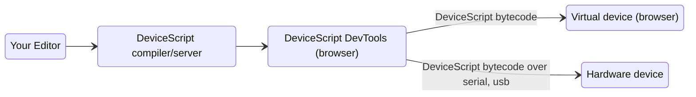
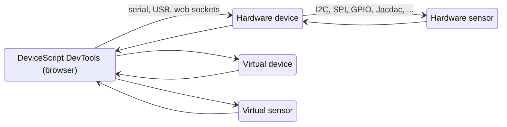

# Developer

The DeviceScript developer experience is designed to be friendly with developers familiar with TypeScript projects.
DeviceScript uses the TypeScript syntax and the developer tooling does not require any special hardware

## Try DeviceScript

You do not need hardware or install any tools to try out DeviceScript. Try running this snippet!

```ts edit codesandbox
ds.every(1, () => {
    console.log(`hello`)
})
```

## How tools work

Communicating with hardware device typically involves a native connection using serial (UARL), USB or Bluetooth.
This kind of communication is typically platform specific and creates a lot of complexity to support cross-platform tools.
Native communication connection typically do not work when working from a container/virtual machine.

On the other hand, modern browsers have been supporting communication with hardware devices, with WebSerial, WebUSB and WebBluetooth. Therefore, this is the preferred solution used by DeviceScript to communicate with hardware.

### Deployment

When developing a DeviceScript program, the command line will start a web server that acts as a bridge between
a developer tools web page and the compilation results.



### Simulation

The DeviceScript developer tool page also acts as a bridge routing the Jacdac packets to all players. This means 
that you can test and debug your scripts in a virtual or hardware device, using virtual or hardware sensors.




:::tip
If you are developing the C++ firmware for DeviceScript,
you will need a more traditional embedded development setup.
:::
