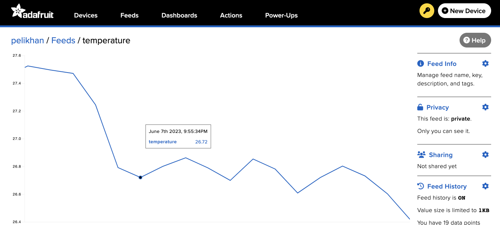

# Adafruit.io

In this sample, we upload temperature readings to [Adafruit.io](https://io.adafruit.com/).
It is free for up to 30 data points per minute. This is a great way to get started with IoT.



We'll assume you have Visual Studio Code installed and the DeviceScript extension installed.

To get started create a new project by using **DeviceScript: Create New Project...**.

## Hardware setup

We'll use the Qt Py and a SHTC3 from Adafruit for this sample.

-    [Adafruit QT Py ESP32-C3 WiFi](https://www.adafruit.com/product/5405) ([configuration](/devices/esp32/adafruit-qt-py-c3))
-   [Adafruit Sensirion SHTC3 Temperature & Humidity Sensor - STEMMA QT / Qwiic](https://www.adafruit.com/product/4636)

Make sure to connect the SHTC3 to the QT Py using the Qwiic connector.

## Firmware setup

The Qt Py firmware might need to be updated to the latest version.

-   connect the QT Py to your computer
-   Click on the **plug** icon in the DeviceScript explorer and select **Flash firmware...**
-   select **Adafruit QT Py ESP32-C3 WiFi**

Once the flashing is done (you may need to install `esptool`), re-connect to the device. If all goes well, it will appear in the device explorer.

## Adafruit.io Configuration

Navigate to [Adafruit.io](https://io.adafruit.com/) and create an account.
Then create a new feed and name it `temperature`.

Make note of your user name and the access key. We'll need those shortly.

## Settings configuration

Before writing the logic of the application, we want to configure the script
for the current hardware. We will need settings to store WiFi configuration, the Adafruit.io secret key,
the pin mapping for the Qt Py and the SHTC3 driver.

-   click on the **wand** icon in the file editor menu
-   select the **Adafruit QT Py ESP32-C3 WiFi**
-   select **Sensirion SHTC3**
-   click on the **wand** again
-   select **Add settings**

Edit `.env.local` and add your Adafruit.io secret key.

> ⚠️ `.env.local` should not be committed to source control.

```yaml
# env.defaults
# public settings, commit to source control
WIFI_SSID=your-wifi-ssid
```

```yaml
# env.local
# secrets, don't commit to source control
IO_KEY=your-secret-key
WIFI_PWD=your-wifi-password
```

## Code

This annotated code sample schedules a task that reads a temperature sensor
and uploads the value to Adafruit.io every minute.

We use the REST API and the **fetch** method to send the data.

```ts
// hardware configuration and drivers
import { pins, board } from "@dsboard/adafruit_qt_py_c3"
import { startSHTC3 } from "@devicescript/drivers"
// extra APIs
import { readSetting } from "@devicescript/settings"
import { schedule } from "@devicescript/runtime"
import { fetch } from "@devicescript/net"

// mounting a temperature server for the SHTC3 sensor
const { temperature, humidity } = await startSHTC3()

// feed configuration
const user = "user"
const feed = "temperature"
// this secret is stored in the .env.local and uploaded to the device settings
const key = await readSetting("IO_KEY")

// Adafruit IO API https://io.adafruit.com/api/docs/#create-data
const url = `https://io.adafruit.com/api/v2/${user}/feeds/${feed}/data`
const headers = { "X-AIO-Key": key, "Content-Type": "application/json" }

console.log({ url })

// run after 1 second and then every minute
schedule(
    async () => {
        // read data from temperature sensor
        const value = await temperature.reading.read()
        // craft Adafruit.io payload
        const body = { value }
        // send request
        const { status } = await fetch(url, {
            method: "POST",
            headers,
            body: JSON.stringify(body),
        })
        // print HTTP status
        console.log({ value, status })
    },
    { timeout: 1000, interval: 60000 }
)
```

## More on Adafruit.IO

If you don't want to remember the REST API syntax, you can use some packages that wrap the Adafruit.io API.

-   https://github.com/pelikhan/devicescript-adafruit-io/

```ts skip
import { pins, board } from "@dsboard/adafruit_qt_py_c3"
import { startSHTC3 } from "@devicescript/drivers"
import { schedule } from "@devicescript/runtime"
// highlight-next-line
import { createData } from "devicescript/adafruit-io"

const { temperature, humidity } = await startSHTC3()

schedule(
    async () => {
        const value = await temperature.reading.read()
        // highlight-next-line
        await createData(value)
    },
    { timeout: 1000, interval: 60000 }
)
```
