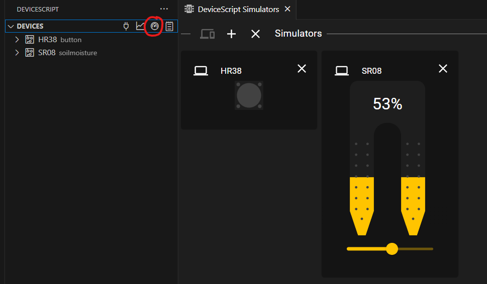
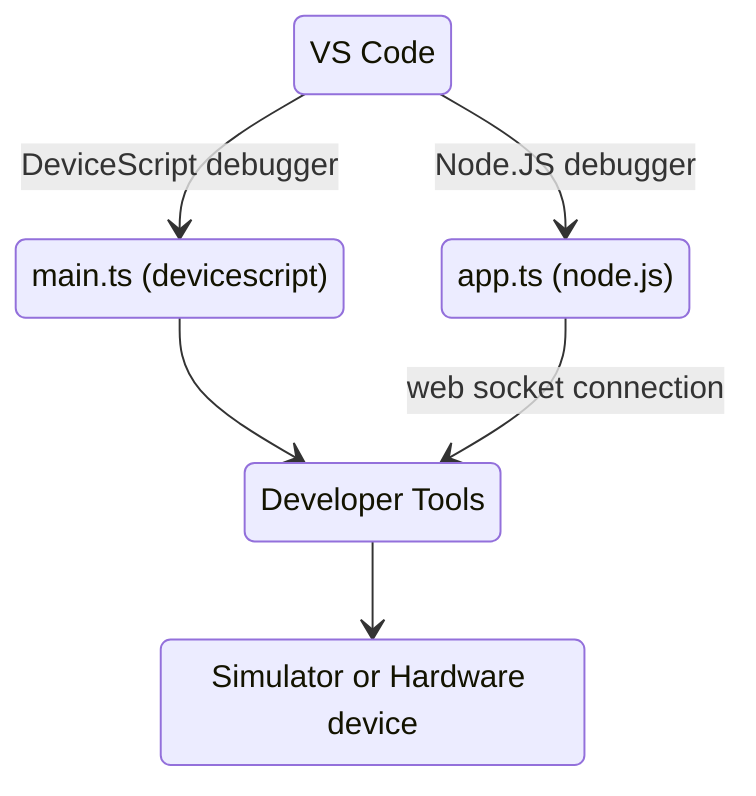

# Simulation

DeviceScript supports simulation through a web dashboard and a Node.JS project running in parallel on the developer machine.

## Simulated DeviceScript Device

DeviceScript will start a simulated programmable microcontroller on demand. You can also start it from the connect dialog.
It runs a [WASM-ed build of the C runtime](/api/vm).


## Dashboard

The simulators dashboard is the most convenient way to start simulating services and testing out your code.

-   Open the DeviceScript view in Visual Studio Code
-   Click on the **dashboard** icon in the **Devices** menu



## Node.JS simulation

For advanced simulation scenario, you can use Node.JS and the [Jacdac TypeScript client library](https://microsoft.github.io/jacdac-docs/clients/javascript/) and,
any other Node package (like your favorite test project), to generate complex scenarios.

Start by configuring your project for simulation by running

```bash
devs add sim
```

or in Visual Studio Code, using the **DeviceScript: Add Sim...** in the command palette.

-   all `.ts` files, expect for the `./sim/` folder, are compiled into DeviceScript bytecode
-   all file under `./sim/` are compiled as a Node.JS application

```
.devicescript/*  libraries and supporting files
src/main.ts          DeviceScript entry point
...
sim/app.ts       Node entry point for the simulator
sim/...
```

### Running using package scripts

The scripts in `package.json` are configured support both DeviceScript and sim `build` and `watch`.

#### build

```bash
# build DeviceScript and node.js sim
yarn build

# build device script only
yarn build:devicescript

# build node.js sim only
yarn build:sim
```

#### watch

```bash
# watch DeviceScript and node.js sim
yarn watch

# watch device script only
yarn watch:devicescript

# watch node.js sim only
yarn watch:sim
```

### Debugging DeviceScript and Node

Visual Studio Code supports [multiple debugging sessions simultaneously](https://code.visualstudio.com/docs/editor/debugging#_launch-configurations) so it is possible to debug your DeviceScript
code and the simulator in the same session.



### `aurascope` example

This simulator sample starts a simulated `psychomagnotheric energy sensor` (custom service) using `jacdac-ts`.

```ts title="./sim/app.ts"
// Jacdac bus that will connect to the devtools server
import { bus } from "./runtime"
// Jacdac helper to simulate services
import { addServer, AnalogSensorServer } from "jacdac-ts"
// custom service
import { SRV_PSYCHOMAGNOTHERIC_ENERGY } from "../.devicescript/ts/constants"

// server for the custom service
const server = new AnalogSensorServer(SRV_PSYCHOMAGNOTHERIC_ENERGY, {
    readingValues: [0.5],
    readingError: [0.1],
    streamingInterval: 500,
})
// change level randomly
setInterval(() => {
    // randomly change the
    const newValue = server.reading.values()[0] + (0.5 - Math.random()) / 10
    server.reading.setValues([newValue])
    console.debug(`psycho value: ${newValue}`)
}, 100)
addServer(bus, "aurascope", server)
```
