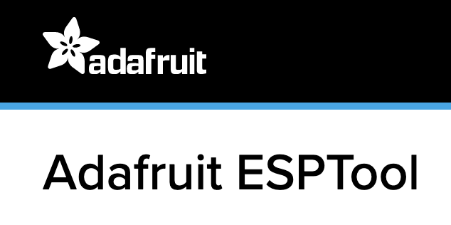
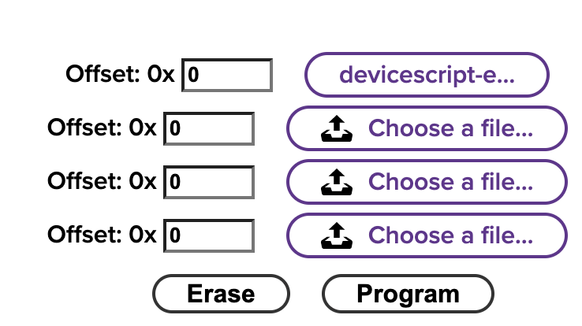

# Adafruit QTPY ESP32 C3 WiFi Dev Board

-  [Product page](https://learn.adafruit.com/adafruit-qt-py-esp32-c3-wifi-dev-board)

## Firmware update

To install the DeviceScript runtime on the board, follow these instructions:

-  download the latest `devicescript-esp32c3-0x0.bin` file from [jacdac-esp32 releases](https://github.com/microsoft/jacdac-esp32/releases/)
-  disconnect board from cable, press `BOOT` button, connect back to USB cable
-  browse to https://adafruit.github.io/Adafruit_WebSerial_ESPTool/

-  press connect
-  load the `.bin` at address `0x0` and press format.

## Connecting

Once the .bin is copied and the board restarted,

-   open the DeviceScript developer tools (click `Edit`)
-   click `Connect`
-   click `Connect Serial`
-   select `USB JTag/...` in the system menu listing devices

After connecting, you should see a new chip under the `DeviceScript` section with the image of the board.
