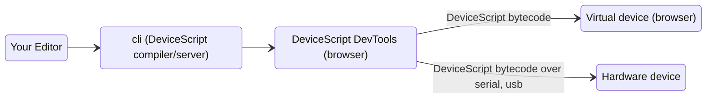
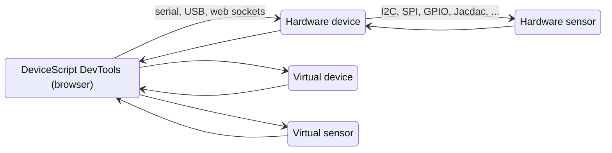

# Command Line

The command line tool is compatible with container and virtual machines so you can run it
in Docker, GitHub Codespaces, ...

## Setting up the project

Let's get started by installing the [DeviceScript command line](/api/cli) and create an empty project

-   Open `code` in a new empty folder
-   Open a terminal (`` Ctrl + ` ``)
-   Use the `init` command to setup a new project

```bash
npx --yes @devicescript/cli@latest init --install
```

You will have the following files created.

```
.devicescript     reserved folder for devicescript generated
    /lib          supporting runtime types and libraries
    /bin          compilation file output
.gitignore        if you are using git, make sure to ignore .devicescript
main.ts           usual name for your entry point application
package.json      projet configuration
tsconfig.json     configure the TypeScript compiler to compile DeviceScript syntax
devsconfig.json   configure the DeviceScript compiler with additional flags. Also used by VSCode extension to activate.
...
```

-   open `main.ts` and copy the following code

```ts
import * as ds from "@devicescript/core"

console.log("starting...")
const sensor = new ds.AirPressure()
const mouse = new ds.HidMouse()
// listen for pressure changes
sensor.pressure.onChange(10, () => {
    // read sensor reading
    const pressure = sensor.pressure.read()
    console.log(pressure)
    // user blows in straw
    if (pressure > 1400) {
        // click!
        console.log(`click!`)
        mouse.setButton(ds.HidMouseButton.Left, ds.HidMouseButtonEvent.Click)
        // debouncing
        ds.sleepMs(50)
    }
})
```

## Launch the build watch

Assuming `main.ts` is the root file of your application,
launch a compilation task in watch mode using this command.

```bash
devsc devtools main.ts
```

or, for short,

```bash
yarn watch
```

The command line task will also start a local web server that will send the compiled bytecode
to a developer tools page similar to the one hosted in the docs.

-   open the developer tools page, typically http://localhost:8081/ (see cli output)
-   use te developer tools page similarly to the embedded docs page

## Edit, deploy, debug loop

From here, your developer inner loop will be very similar to building/debugging a web site with hot reload.

-   make an edit in your source file, say `main.ts`
-   after a couple seconds, the compiler picks up the changes, produces a new bytecode and sends it to the developer tools
-   the developer tools automatically deploy thew bytecode to the select device (by default the simulator)
-   switch from VS Code to the browser and debug your new code

## DeviceScript basics

Navigate to the [Developer section](/developer) to learn the basics of the language.

## How tools work

Communicating with hardware device typically involves a native connection using serial (UARL), USB or Bluetooth.
This kind of communication is typically platform specific and creates a lot of complexity to support cross-platform tools.
Native communication connection typically do not work when working from a container/virtual machine.

On the other hand, modern browsers have been supporting communication with hardware devices, with WebSerial, WebUSB and WebBluetooth. Therefore, this is the preferred solution used by DeviceScript to communicate with hardware.

### Deployment

When developing a DeviceScript program, the command line will start a web server that acts as a bridge between
a developer tools web page and the compilation results.



### Simulation

The DeviceScript developer tool page also acts as a bridge routing the Jacdac packets to all players. This means
that you can test and debug your scripts in a virtual or hardware device, using virtual or hardware sensors.


