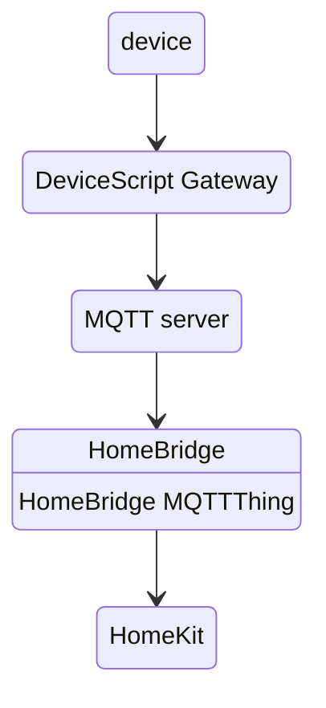

# Homebridge + Humidity Sensor

In this sample, we will use [HomeBridge](https://homebridge.io/) to integrate our device with Apple HomeKit. As an example, we will expose a humidity sensor to HomeKit.

[HomeBridge](https://homebridge.io/) allows you to integrate with smart home devices that do not natively support HomeKit.
Using the [HomeBridge MQTTThing plugin](https://www.npmjs.com/package/homebridge-mqttthing), you can integrate your MQTT Things with HomeKit.
The [DeviceScript Gateway](/developer/cloud/gateway) can be configured to route [cloud messages](/developer/cloud/messages) to a MQTT server which can then be used by HomeBridge.



## MQTT server configuration

-   Start a MQTT server. You can find a [list of servers here](https://mqtt.org/software/).

You will need the URL, port and optionaly username, password to configure the gateway.

## Device Gateway configuration

-   Clone or create a [DeviceScript Gateway](/developer/cloud/gateway) (by starting a GitHub Codespace for example)
-   Configure it to route the messages to the MQTT server
-   Start the development server. If you are using GitHub Codespaces, make sure to change the visibility of the port to `Public` in the `Ports` pane.
-   Copy the connection string that is printed in the terminal output and enter it in the `DeviceScript Gateway` pane in Visual Studio Code. You should get a confirmation that the gateway is connected.

## HomeBridge configuration

-   Install [HomeBridge](https://homebridge)
-   Open the plugins pane and install the [HomeBridge MQTTThing plugin](https://www.npmjs.com/package/homebridge-mqttthing) plugin
-   Click on `SETTINGS` for the MQTTThing plugin and add a **Humidity Sensor** accessory
-   Configure the MQTT settings to connect to the MQTT server
-   Scroll down to the **MQTT topics** and set the `get Humidity` topic to `humidity`

## Programming with simulators

We can start programming with devicescript by using the simulator. The simulator allows you to test your code without having to deploy it to a physical device.

-   Create a new DeviceScript project using the `DeviceScript: New Project` command
-   Open `main.ts` and add the following code and click the `Run` icon on the file menu.

```ts
import { Humidity } from "@devicescript/core"
import { throttleTime } from "@devicescript/observables"

const sensor = new Humidity()
sensor.reading.pipe(throttleTime(5000)).subscribe(humidity => {
    console.data({ humidity })
})
```

Once the simulator is running and you start the humidity sensor simulator, you should see the humidity readings in the console.

-   Open the `DeviceScript Gateway` pane
-   Click on the `+` near devices to register the simulator

Update the program to publish the humidity readings to the cloud.

```ts
import { Humidity } from "@devicescript/core"
import { throttleTime } from "@devicescript/observables"
// highlight-next-line
import { publishMessage } from "@devicescript/cloud"

const sensor = new Humidity()
sensor.reading.pipe(throttleTime(5000)).subscribe(async humidity => {
    console.data({ humidity })
    // highlight-next-line
    await publishMessage("/humidity", { humidity })
})
```

:::tip

Notice that the topic starts with `/`. By default DeviceScript routes topics to `devs/{deviceid}/from/{topic}`. Starting the topic with `/` disables this mode.

:::

-   open HomeBridge and you should see the humidity being updated from the values on the sensor. Try to move the slider on the humidity sensor simulator to verify that the values are updated.

## Programming hardware

-   Click the `plug` icon and connect your device
-   Click on the magic wand icon on the file menu and select your hardware device. Then add the code to connect to the `startSHTC3`.

```ts
import { Humidity } from "@devicescript/core"
import { throttleTime } from "@devicescript/observables"
import { publishMessage } from "@devicescript/cloud"
// highlight-next-line
import { startSHTC3 } from "@devicescript/drivers"

// highlight-next-line
const { humidity: sensor } = await startSHTC3()

sensor.reading.pipe(throttleTime(5000)).subscribe(async humidity => {
    console.data({ humidity })
    await publishMessage("/humidity", { humidity })
})
```

-   Click the play button to deploy the script to your board and test it.

## Managing the device with the Gateway

The last step is to upload the script to the gateway and assign this script to the device. The gateway will automatically deploy the script to the device.

In the Device Gateway view,

-   Click `+` next to script and add your script
-   Click `script` icon near the device and assign the script you've just uploaded

## Next steps

-   If you want to continue iterating locally, make sure to clear the script assigned to your device (the extension will remind).
-   If you upload a new version of the script, make sure to update the assigned script on the device too.
