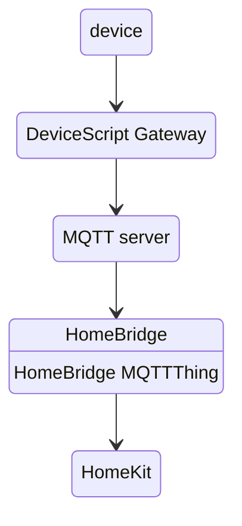

# Homebridge + Humidity Sensor

In this sample, we will use [HomeBridge](https://homebridge.io/) to integrate our device with Apple HomeKit. As an example, we will expose a humidity sensor to HomeKit.

[HomeBridge](https://homebridge.io/) allows you to integrate with smart home devices that do not natively support HomeKit.
Using the [HomeBridge MQTTThing plugin](https://www.npmjs.com/package/homebridge-mqttthing), you can integrate your MQTT Things with HomeKit.
The [DeviceScript Gateway](/developer/cloud/gateway) can be configured to route [cloud messages](/developer/cloud/messages) to a MQTT server which can then be used by HomeBridge.



## Cloud configuration

-   Start a MQTT server. You can find a [list of servers here](https://mqtt.org/software/).
-   Start a [DeviceScript Gateway](/developer/cloud/gateway) and configure it to route the messages to the MQTT server
-   Install [HomeBridge](https://homebridge)

## HomeBridge configuration

-   Open the plugins pane and install the [HomeBridge MQTTThing plugin](https://www.npmjs.com/package/homebridge-mqttthing) plugin
-   Click on `SETTINGS` for the MQTTThing plugin and add a **Humidity Sensor** accessory
-   Scroll down to the **MQTT settings** and set the `get Humidity` topic to `office/humidity`

## Programming the device

-   Open Visual Studio Code and make sure to have the [DeviceScript extension](/getting-started/vscode) installed
-   Open the `DeviceScript Gateway` pane and configure it with the connection string that was printed in the gateway terminal output

## Programming the simulator

We can start programming with devicescript by using the simulator. The simulator allows you to test your code without having to deploy it to a physical device.

-   Create a new DeviceScript project using the `DeviceScript: New Project` command
-   Open `main.ts` and add the following code and click the `Run` icon on the file menu.

```ts
import { Humidity } from "@devicescript/core"

const sensor = new Humidity()
humidity.reading.subscribe(humidity => {
    console.data({ humidity })
})
```

Once the simulator is running and you start the humidity sensor simulator, you should see the humidity readings in the console.

-   Open the `DeviceScript Gateway` pane
-   Click on the `+` near devices to register the simulator

Update the program to publish the humidity readings to the cloud.

```ts
import { Humidity } from "@devicescript/core"
// highlight-next-line
import { publishMessage } from "@devicescript/cloud"

const sensor = new Humidity()
humidity.reading.subscribe(humidity => {
    // highlight-next-line
    await publishMessage("/humidity", { humidity })
})
```

:::tip

Notice that the topic starts with `/`. By default DeviceScript routes topics to `devs/{deviceid}/from/{topic}`. Starting the topic with `/` disables this mode.

:::
