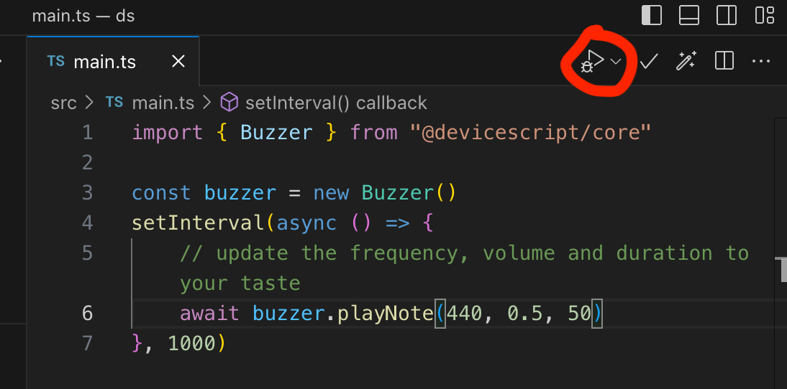

# DeviceScript Workshop

Leverage your TypeScript skills to program electronics using [DeviceScript](https://microsoft.github.io/devicescript/).

## Time Estimate
2.0 hours

## Overview
This project will introduce participants to DeviceScript, a TypeScript programming environment for small electronics, including sensing and interacting with the physical environment using a common microcontroller - ESP32-C3. 

- Participants will program a microcontroller to retrieve data readings from the sensor and then act upon that data. 
- Participants will use `fetch` to call a Web API (GitHub build status) and update an LED based on the result.

## Who are You?
The ideal participant is someone who is familiar with TypeScript (front-end or back-end). Experience with electronics is **not** required.

## Activity Outcome
Participants should have a device programmed with DeviceScript that can detect moisture levels in their plant soil, 
show some light animation on a LED display. Update the LED display based on the build status of their favorite GitHub repository. 

Participants will have learned to:
- Connect sensors to read the phyiscal environment (BME680)
- Control the physical environment by playing sounds on buzzer, animating LEDs
- Deploy DeviceScript scripts to hardware device
- Issue Web HTTP requests

## Required Materials
These items are required.

|Image|Item|Url|
|---|---|---|
| | Xiao ESP32C3 + Breakout broard | https://microsoft.github.io/devicescript/devices/esp32/seeed-xiao-esp32c3-msr218 |
|  | BME680 sensor | https://www.seeedstudio.com/Grove-Temperature-Humidity-Pressure-and-Gas-Sensor-for-Arduino-BME680.html?queryID=3a720270a67b60e6bdac9638b0b9e5f0&objectID=100&indexName=bazaar_retailer_products |
|  | Buzzer | https://www.seeedstudio.com/Grove-Buzzer.html?queryID=fd5ea919ecbc76ef7f1e4210879a99fd&objectID=1805&indexName=bazaar_retailer_products |
|  | Grove cables | https://www.seeedstudio.com/Grove-Universal-4-Pin-Buckled-20cm-Cable-5-PCs-pack.html?queryID=f4ec2714afc36affeef7955392573644&objectID=1693&indexName=bazaar_retailer_products |
|  | KittenBot Jacdac Kit A | https://microsoft.github.io/jacdac-docs/devices/kittenbot/jacdacstarterkitawithjacdaptorformicrobitv2v10/ |
|  | USB-C cables | https://www.seeedstudio.com/USB-3-1-Type-C-to-A-Cable-1-Meter-3-1A-p-4085.html?queryID=6bd7ee107594c139732c712ddb72eca0&objectID=4085&indexName=bazaar_retailer_products |
 
## Prerequisites: 
This workshop does not require experience with programming or electronics. However to make the most of the time, experience with TypeScript is helpful.
 
### Setup

DeviceScript is tested on Windows and MacOS. Results may vary in other environment, depending of the support of [serialport](https://www.npmjs.com/package/serialport). The programming can be done from containers (GitHub Codespaces, docker, WSL2) but access to Serial/USB typically requires to run on the host OS.

- Install [Node.JS 18+](https://nodejs.org/en/download/) and [Visual Studio Code](https://code.visualstudio.com/)
- Install [DeviceScript extension v2.10.2+](https://marketplace.visualstudio.com/items?itemName=devicescript.devicescript-vscode) ([more info...](https://microsoft.github.io/devicescript/getting-started/vscode)). If you have an older installation of the extension, make sure to take the update.

## Getting started

- Open VS Code
- Make sure that the [DeviceScript extension](https://marketplace.visualstudio.com/items?itemName=devicescript.devicescript-vscode) is installed
- Open the command palette and run the `DeviceScript: Create new Project...` command.


- Once the project is created, reopen the project in VSCode


## Part 1: Programming with simulators

Before we start working wiith hardware, we can start programming and debugging embedded application using simulators, both for the main board and the sensors.

- edit `src/main.ts` to contain:
```ts
import { Buzzer } from "@devicescript/core"

const buzzer = new Buzzer()
setInterval(async () => {
    // update the frequency, volume and duration to your taste
    await buzzer.playNote(440, 0.5, 50)
}, 1000)
```
- click on Play button on the editor menu in the top-right corner

- in the simulator pane click auto-start to start the buzzer simulator

- enable sound on the simulator
- enjoy the music!

### More tutorials

- Follow the [Blinky](https://microsoft.github.io/devicescript/getting-started/samples/blinky) to get used to the DeviceScript interface
- Follow the [Thermostat](https://microsoft.github.io/devicescript/getting-started/samples/thermostat) to get used to handle sensor data

## Part 2: Configuring the Hardware

Now that we have a simple program working on simulator, it is time to specialize it for the available sensor and test it out on hardware.

Let's start by making sure the DeviceScript firmware is updated.

- Connect the BME680 sensor to the Qwic connector
- Connect the Buzzer to the Grove connector **A0**
- Connect the KittenBot LED ring to the Jacdac connector
- Connect Xiao board to your computer using the USB-C cable
- Make sure the Python extension is installed, along with a Python runtime
- Open the **DeviceScript** view and click on the **plug** to connect to your Xiao.


- Select **Flash Firmware...**
- Scroll down and select **Seeed Studio XIAO ESP32C3 with MSR218 base**


Once the flashing process is over,

- Open the **DeviceScript** view and click on the **plug** to connect to your Xiao.
- Select **Serial**


- Your device should be appearing in the device explorer!


## Part 4: Sensors

- Open **main.ts** and click on the **magic wand** icon in the file menu.


The wizard will add an import that contains the pin mapping for the Xiao and search for `startBME680`. Repeat the operation for `startBuzzer`

```ts
import { pins, board } from "@dsboard/seeed_xiao_esp32c3_msr218"
import { startBME680 } from "@devicescript/drivers"
import { startBuzzer } from "@devicescript/servers"

const { temperature, humidity, pressure, airQualityIndex } = await startBME680()
const buzzer = startBuzzer({
    pin: pins.A0,
})
```

## Part 5: Funny humidity meter

Here is a tiny toy example that puts everything together. 
It buzzes and turns the LEDs red if the humidity gets too high. In the simulator, drag the slider
or blow on the BME680 sensor to test it out.

If you want to use simulator, disconnect the hardware and restart.

```ts
import { pins, board } from "@dsboard/seeed_xiao_esp32c3_msr218"
import { startBME680 } from "@devicescript/drivers"
import { startBuzzer } from "@devicescript/servers"
import { setStatusLight } from "@devicescript/runtime"

const { temperature, humidity, pressure, airQualityIndex } = await startBME680()
const buzzer = startBuzzer({
    pin: pins.A0,
})

setInterval(async () => {
    // read humidity sensor data
    // improvements: what about filtering?
    const h = await humidity.reading.read()
    // buzz if humidity goes above 80%
    if (h > 80) await buzzer.playNote(440, 0.5, 500)

    // show red on LEDs if humidity goes above 80%
    if (h > 80) await setStatusLight(0xff0000)
    // otherwise turn off
    else await setStatusLight(0)
}, 1000)
```

## Part 6: Connecting the XIAO to MSFTGUEST

You need to register the XIAO MAC address in order for it to connect to the MSFTGUESS network.

- In the **Devices** tree, find the **WiFi MAC** field value and copy it.


- Navigate to https://aka.ms/getconnected , click **Quick Registration - Wireless**, **Guest Account (MSFTGUEST)**, and register your device MAC address


- Find MSFTGUEST in the list of APs, click the **plug** icon and press Enter to leave the password empty.


## Part 7: Settings and secrets

In this section, we'll add a GET call to the GitHub repository status API and use it to change the LED color.

First thing first, we'll add .env files to the project to store the github configuration and **secret** token.

- Click on the **wand** icon on the file menu
- Select **Add Settings...**

Update `.env.defaults` with the public settings (checked in)

```yaml
# .env.defaults = public settings
GITHUB_OWNER=microsoft
GITHUB_REPO=devicescript
GITHUB_REF=main
```

Secrets are stored in the `./env.local` file. This file is not part of the source code and **should not be committed to a repository**.
The GitHub token needs `repo:status` scope (and no more). You can create a token in the [GitHub settings](https://github.com/settings/tokens).

```yaml
# .env.local = secrets, do not commit
GITHUB_TOKEN=...
```


```ts
import { readSetting } from "@devicescript/settings"

// read configuration from ./env.defaults
const owner = await readSetting("GITHUB_OWNER")
const repo = await readSetting("GITHUB_REPO")
const ref = await readSetting("GITHUB_REF", "main")
// read secret from ./env.local
const token = await readSetting("GITHUB_TOKEN")

console.log({ owner, repo, ref })
```

## Part 8: Fetching GitHub Build Status

DeviceScript provides a [Fetch API](https://microsoft.github.io/devicescript/developer/net) similar to the browser [fetch](https://developer.mozilla.org/en-US/docs/Web/API/Fetch_API). You can use it to issue web requests.

This snippet makes the query to github and updates the status. 
Feel free to remix it to integrate it into your current application

```ts
import { readSetting } from "@devicescript/settings"
import { fetch } from "@devicescript/net"
import { setStatusLight, schedule } from "@devicescript/runtime"

// read configuration from ./env.defaults
const owner = await readSetting("GITHUB_OWNER")
const repo = await readSetting("GITHUB_REPO")
// read ref or default to 'main'
const ref = await readSetting("GITHUB_REF", "main")
// read secret from ./env.local
const token = await readSetting("GITHUB_TOKEN", "")

if (!owner || !repo) throw new Error("missing configuration")

// track state of last fetch
let state: "failure" | "pending" | "success" | "error" | "" = ""
let blinki = 0

// update status light
setInterval(async () => {
    blinki++
    let c = 0x000000
    if (state === "failure")
        c = blinki % 2 === 0 ? 0x100000 : 0x000000 // blink fast red
    else if (state === "pending")
        c = (blinki >> 1) % 2 === 0 ? 0x100500 : 0x000000 // blink slow orange
    else if (state === "success") c = 0x000a00 // solid green
    else c = 0x000000 // dark if any error
    await setStatusLight(c)
}, 500)

// query github every 5s
schedule(async () => {
    const res = await fetch(
        `https://api.github.com/repos/${owner}/${repo}/commits/${ref}/status`,
        {
            headers: {
                Accept: "application/vnd.github+json",
                Authorization: token ? `Bearer ${token}` : undefined,
                "X-GitHub-Api-Version": "2022-11-28",
            },
        }
    )
    if (res.status === 200) {
        const json = await res.json()
        state = json.state
        console.log({ json, state })
    } else state = "error"
}, { timeout: 1000, interval: 5000 })
```

Memory is limited! Be careful about using Web APIs that return huge payloads as you will surely run out of memory...

## Resources

- Session Recording
- [DeviceScript Documentation](https://microsoft.github.io/devicescript/)

## Content Owner
Contact [Peli de Halleux](<mailto:jhalleux@microsoft.com>)
