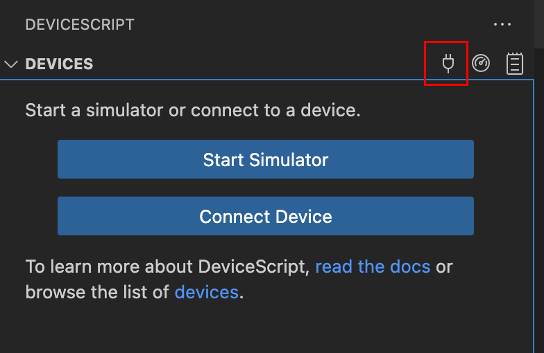
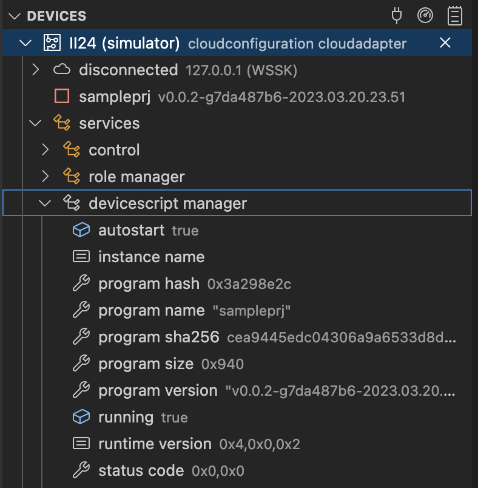

# Simulation

DeviceScript provides a rich support for simulating devices and periphericals.
The Visual Studio Code extension makes it easy to start and stop simulators.

## DeviceScript simulator

The first simulator you use is a DeviceScript Manager device, a device capable of running the DeviceScript bytecode.
It runs the DeviceScript C firmware compiled into WebAssembly.
This WASM simulator will be launched by the debugger or by clicking on the `plug` icon in the DeviceScript pane.

Once started the simulator will appear in the device tree and you can explore its services and status.

