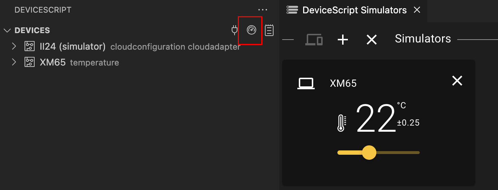

# Simulation

DeviceScript provides a rich support for simulating devices and peripherals.
The Visual Studio Code extension makes it easy to start and stop simulators.

## DeviceScript simulator

The first simulator you use is a DeviceScript Manager device, a device capable of running the DeviceScript bytecode.
It runs the DeviceScript C firmware compiled into WebAssembly.
This WASM simulator will be launched by the debugger or by clicking on the `plug` icon in the DeviceScript pane.

Once started the simulator will appear in the device tree and you can explore its services and status.

## Peripherals dashboard

The `dashboard` icon starts a peripheral dashboard view (the Jacdac dashboard).
It allows to visualize any connected device and also launch simulator peripherals.
The simulator peripheral are typically interactive and allow to change the values using UI controls.

:::note

The dashboard loads the Jacdac simulator from https://microsoft.github.io/jacdac-docs and requires internet access.

:::

## Custom servers

It is also possible to create peripheral simulators in "node.js TypeScript" (running in a node.js process).
This technique is documented in the [developer documentation](/developer/simulation).
