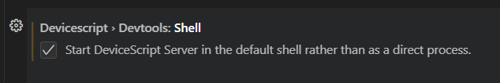

# Troubleshooting {#troubleshooting}

## Node.JS v16+ not installed

Make sure that your installed [Node.JS](https://nodejs.org/en/download) version is v16+. Some linux distribution may
install an older version of Node.JS by default.

```bash
> node --version
v18.16.0
```

:::tip

[nvm](https://github.com/nvm-sh/nvm) is a convinient way to install
and manage multiple Node.JS versions.

:::

## DeviceScript CLI not installed

The development server runs the DeviceScript command line (`@devicescript/cli`) installed
locally in your project.
Make sure `@devicescript/cli` has been
added as a developer dependency to your project, and that dependencies have been installed.

```bash
yarn add -D @devicescript/cli@latest
yarn install
```

## DeviceScript terminal won't start

The DeviceScript extension spawns a Node.JS process to
run the debugger adapter, connect to hardware device and build sources.
Depending on your machine configuration, you may have to specify where the Node.JS binaries
are located.

Start by enable the `Devtools: Shell` preference so that DeviceScript start node is a terminal rather directly.
This allows you to look at the potential error messages.

-   Open the **User Settings**
-   Search for **DeviceScript Devtools shell**
-   Reload Visual Studio Code



If the error messages indicates that the `node` process cannot be resolved, you may want to specify the path
of your node.js v16+ manually in the user settings.

-   Open the **User Settings**
-   Search for **DeviceScript node** and update the Node.JS binary path
-   Reload Visual Studio Code

## Port 8081 is used

It may happen that a previous session left the development server dangling, run this command to kill processes hanging on port `8081`.

```bash
npx kill-port 8081
```

## Serial connection won't connect

-   serial connection used by another application
-   make sure the [serialport](https://www.npmjs.com/package/serialport) package is installed
-   running in remote workspace

## Can't connect after I deployed my program aka Factory Reset

First reset the device, or unplug and plug back in.
If this doesn't help, select "Clean Flash..."
from the connect menu and once done select "Flash Firmware..." from the same menu.
