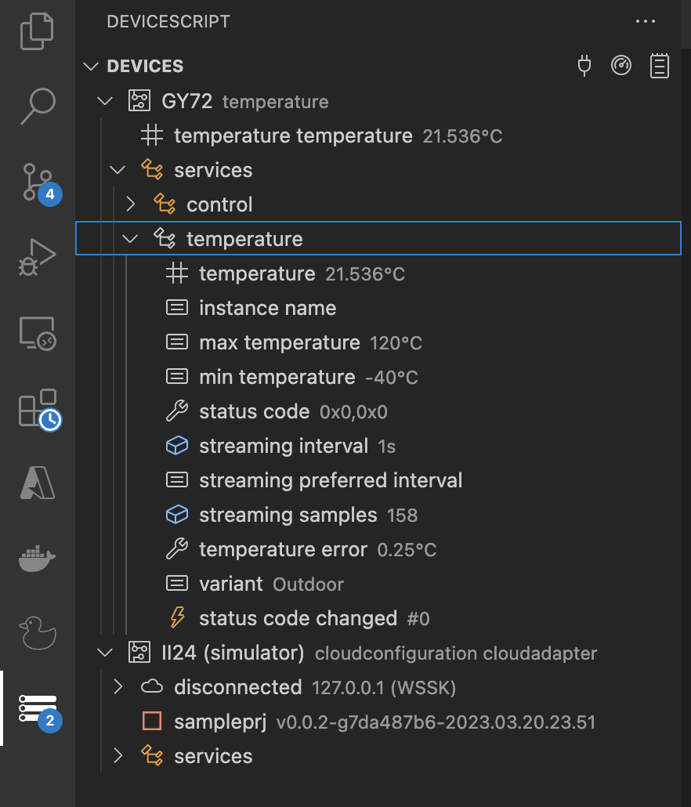
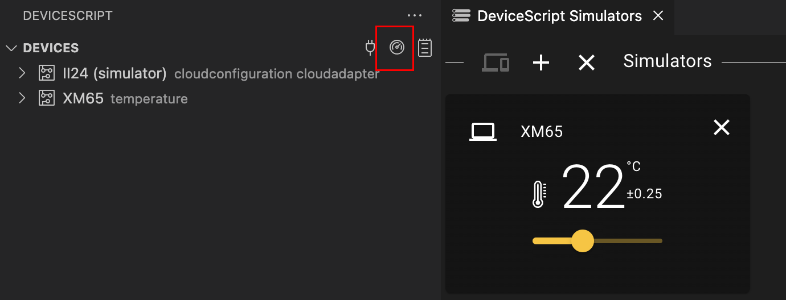
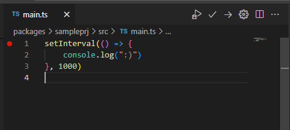
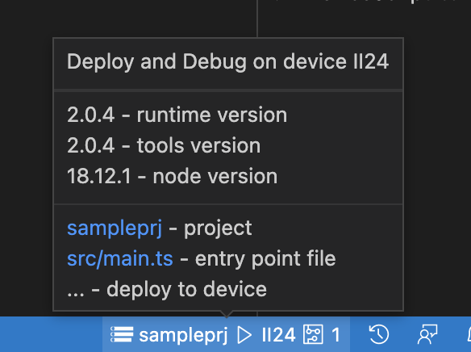

# User interface

## Device Explorer

The DeviceScript view is opened by clicking the Jacdac logo in the left bar menu.

It provides a treeview of the device, services, registers and events. The tree view updates
automatically with live data from the simulators and devices.

### Device Explorer Actions

The view has 3 actions:

-   `connect`, the plug icon, which allows you to connect to a physical device, start the simulator or flash new firmware.
-   `dashboard`, starts the peripheral simulator dashboard
-   `terminal`, displays the DeviceScript terminal

### Register and Events watch

You can _watch_ any register or event in the device explorer. This provides a way to 'pin' a register for debugging
or monitoring.

## Editor title actions

Any `main*.ts` file in a DeviceScript project will have added action in the editor title.

-   `Debug`: starts a debugging session from this file,
-   `Build`: builds the binary for this entry point file,
-   `Upload`: builds and deploys the binary to the current device
-   `Configure`: a wizard experience that helps you configure the code for your hardware device

## Terminal

The DeviceScript terminal displays the status of the development tool process and the console output from devices.

## Status bar

The DeviceScript status shows a Jacdac logo and the current project name (the extension works on a single project at a time).
You can hover over the status to get more information or click to change the current project.

