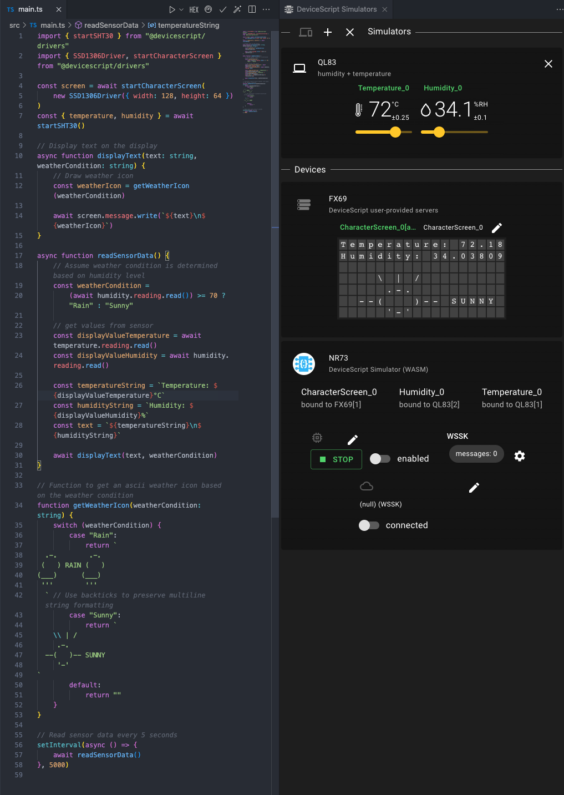

# Weather Display

A simple weather display that gets new values every 5 seconds from a temperature and humidity sensor and displays them in a character display with a ascii symbol based on the humidity.

## Configuring the hardware

Make sure to configure your program for your
hardware board so that the I2C pins are [configured correctly](/developer/board-configuration).

## Logging sensor data

Let's start by mounting a `sensor` client and logging each sensor reading to the display using several functions.

```tsx
import { startSHT30 } from "@devicescript/drivers"
import {
    SSD1306Driver,
    startCharacterScreenDisplay,
} from "@devicescript/drivers"

const screen = await startCharacterScreenDisplay(
    new SSD1306Driver({ width: 128, height: 64 })
)
const { temperature, humidity } = await startSHT30()

async function displayText(text: string, weatherCondition: string) {
    const weatherIcon = getWeatherIcon(weatherCondition)

    await screen.message.write(`${text}\n${weatherIcon}`)
}

async function readSensorData() {
    // Assume weather condition is determined based on humidity level
    const weatherCondition =
        (await humidity.reading.read()) >= 70 ? "Rain" : "Sunny"

    // get values from sensor
    const displayValueTemperature = await temperature.reading.read()
    const displayValueHumidity = await humidity.reading.read()

    const temperatureString = `Temperature: ${displayValueTemperature}°C`
    const humidityString = `Humidity: ${displayValueHumidity}%`
    const text = `${temperatureString}\n${humidityString}`

    await displayText(text, weatherCondition)
}

// Function to get an ascii weather icon based on the weather condition
function getWeatherIcon(weatherCondition: string) {
    switch (weatherCondition) {
        case "Rain":
            return `
  .-.        .-.  
 (   ) RAIN (   )
(___)      (___) 
 '''        '''  
  ` // Use backticks to preserve multiline string formatting
        case "Sunny":
            return `
    \\ | /    
     .-.       
  --(   )-- SUNNY
     '-'    
`
        default:
            return ""
    }
}

// Read sensor data every 5 seconds
setInterval(async () => {
    await readSensorData()
}, 5000)
```



## See also

The [value dashboard](./weather-dashboard) simplifies the display of sensor data
on a character screen.
